| +truncate | 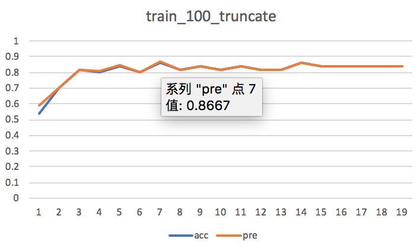acc/pre: 0.86/0.8667 ↑提升6-7个百分点 | 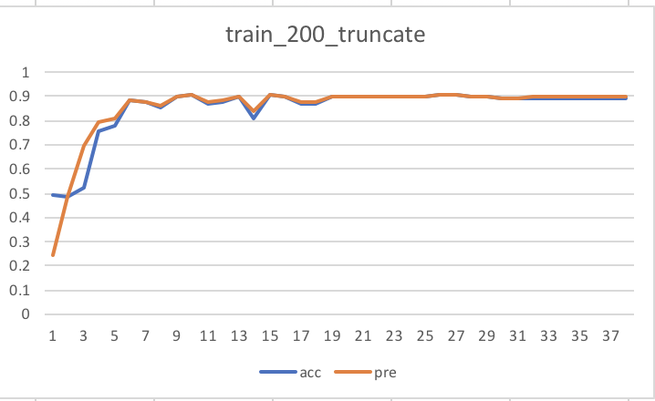acc/pre: 0.908,0.9082 ↑提升3个百分点 | 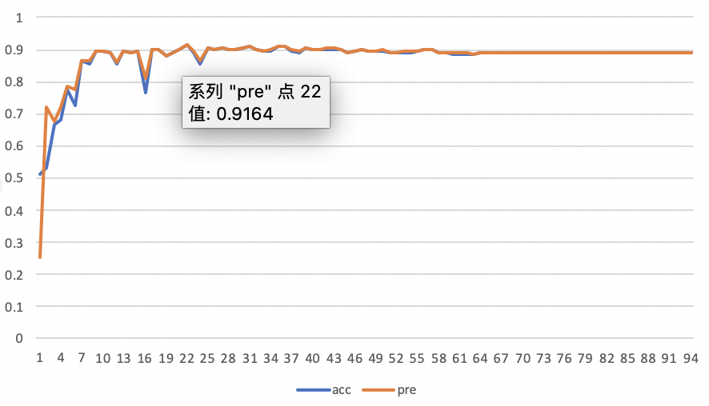acc/pre: 0.916,0.9164 ↑提升1个百分点 | 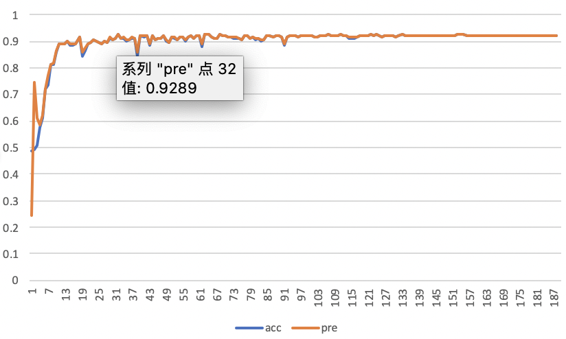acc/pre: 0.928,0.9289 ↑提升1.6个百分点 |

shell输出：
                       [-t TRUNCATE] [-r POS_REPLACE] [-w W2V_REPLACE]

  - [LAC](https://github.com/baidu/lac)安装最新版本：pip install lac

| pos      | lac               | 同词性词替换，依赖LAC算子进行分词和词性标注 |

```
```shell
- - gensim安装最新版本：pip install gensim
开发套件用于数据增强的python脚本位于目录./applications/tools/data_aug/data_aug.py
cd ./applications/tasks/text_classification/
- 运行data_aug.py脚本
## 下游任务使用demo


```shell
python data_aug.py "输入文件夹的目录" "输出文件夹的目录"

- 进去下游任务（分类任务）
shell输入：

| 模块     | 依赖              | 原理简介                                    |
| -------- | ----------------- | ------------------------------------------- |
- 可通过入口参数配置各增强策略的概率比例，在数据的一次增强中使用多种增强策略
| truncate | no                | 随机删除                                    |
                       [-e ERNIE_REPLACE] [--unk_token UNK_TOKEN]
| w2v      | lac, gensim, tqdm | 词向量近义词替换                            |
                       input output
## 策略简介
    
      -r POS_REPLACE, --pos_replace POS_REPLACE            #pos_replace 增强策略的概率
- 目前文心2.1.0数据增强工具提供4种增强策略：遮盖、删除、同词性词替换、词向量近义词替换

## 脚本运行（说明）
| +unk      | 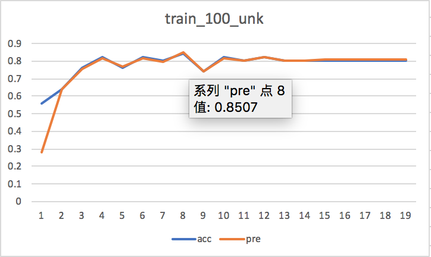acc/pre: 0.84/0.8507 ↑提升4-5个百分点 | 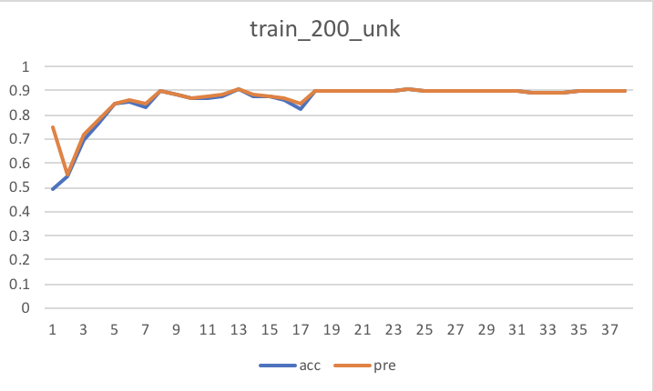acc/pre: 0.906,0.9059 ↑提升3个百分点 | 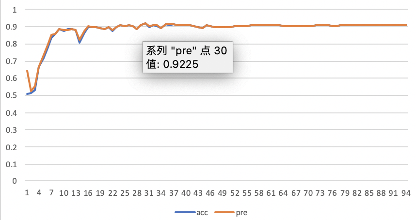acc/pre: 0.922,0.9225 ↑提升1.6个百分点 | 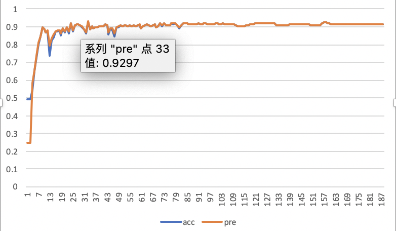acc/pre: 0.928,0.9297 ↑提升1.6个百分点 |

      -t TRUNCATE, --truncate TRUNCATE                     #truncate 增强策略的概率
- data_aug.py脚本传参说明
- 依赖说明：

sh run_with_data_aug.sh
| --------- | ------------------------------------------------------------ | ------------------------------------------------------------ | ------------------------------------------------------------ | ------------------------------------------------------------ |

```shell


| Base+CNN  | 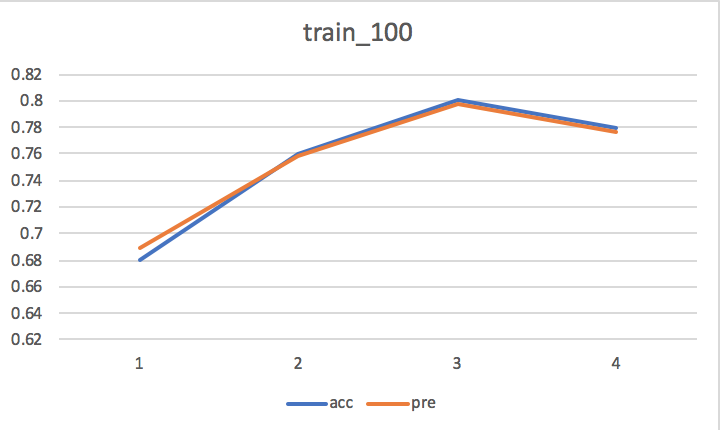acc/pre: 0.8/0.7971                           | 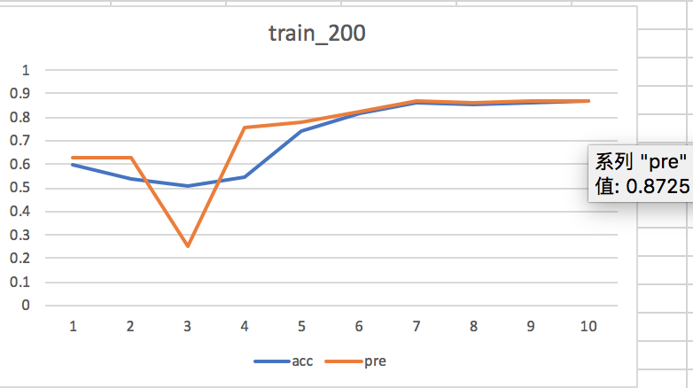acc/pre: 0.87,0.8725                          | 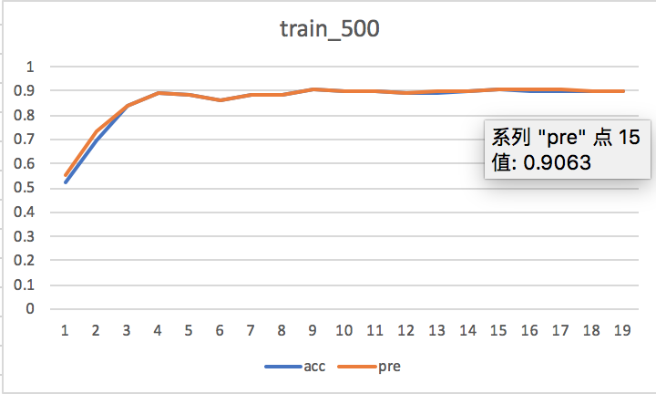acc/pre: 0.906,0.9063 | 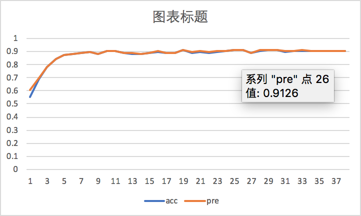acc/pre: 0.912,0.9126 |
```
### 分类任务
| +w2v      | 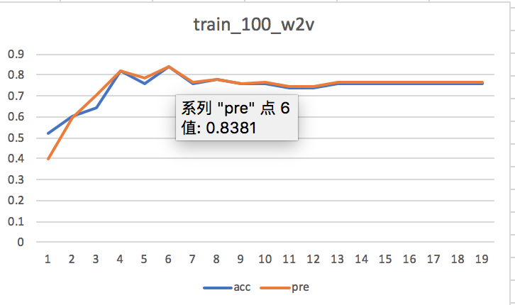acc/pre: 0.84/0.8381 ↑提升4个百分点 | 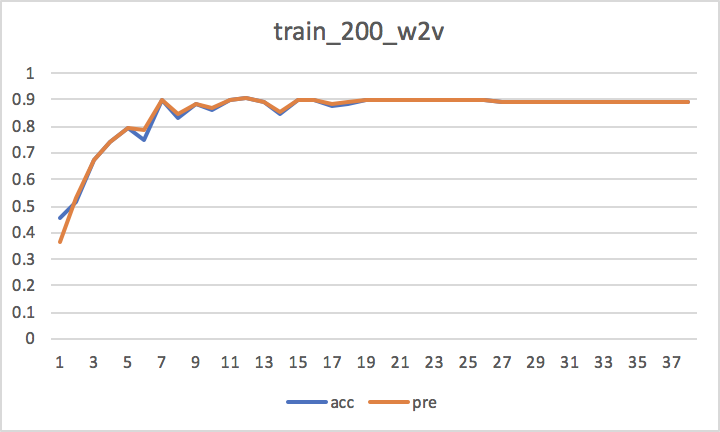acc/pre: 0.904,0.904 ↑提升3个百分点 | 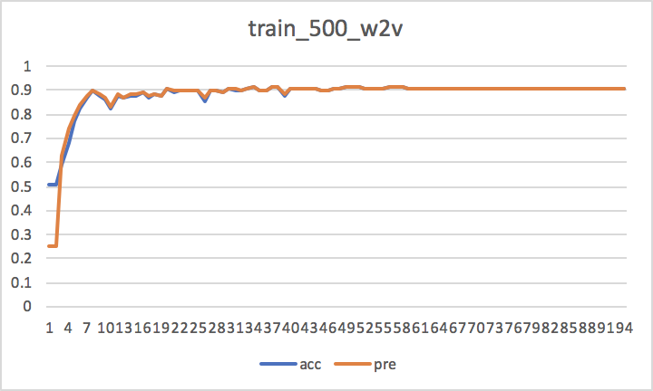acc/pre: 0.916,0.9164 ↑提升1个百分点 | 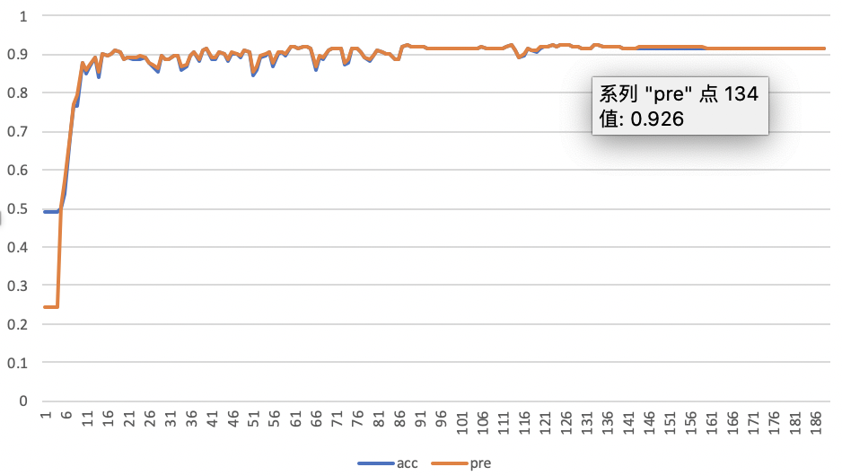acc/pre: 0.926,0.926 ↑提升1.4个百分点 |
    positional arguments:
      -c COLUMN_NUMBER, --column_number COLUMN_NUMBER      #明文文件中所要增强列的列序号，多列用逗号分割，如：1,2
| **Model** | **训练集样本数目：100条****测试集样本数目：50条**            | **训练集样本数目：200条****测试集样本数目：500条**           | **训练集样本数目：500条****测试集样本数目：500条**           | **训练集样本数目：1000条****测试集样本数目：500条**          |
```java
```
| +pos      | 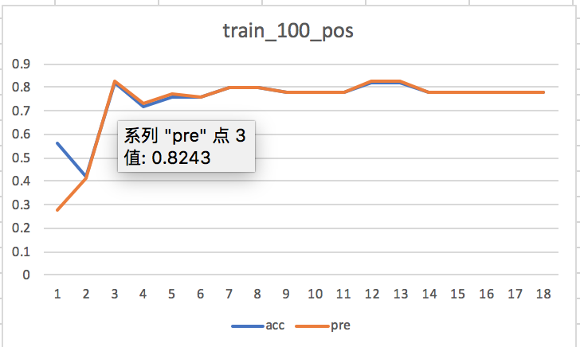acc/pre: 0.82/0.8243 ↑提升2-3个百分点 | 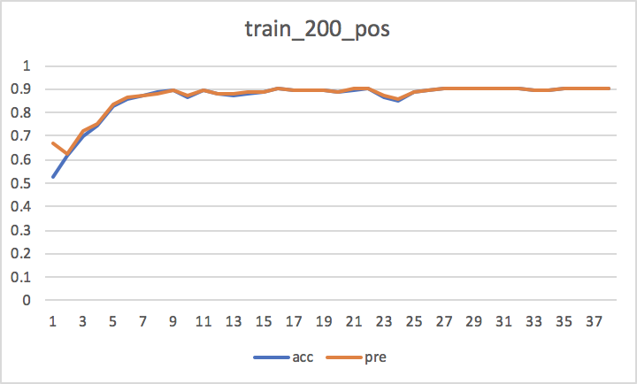acc/pre: 0.906,0.9061 ↑提升3个百分点 | 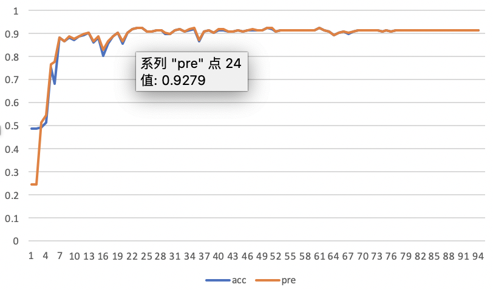acc/pre: 0.926,0.9279 ↑提升4个百分点 | 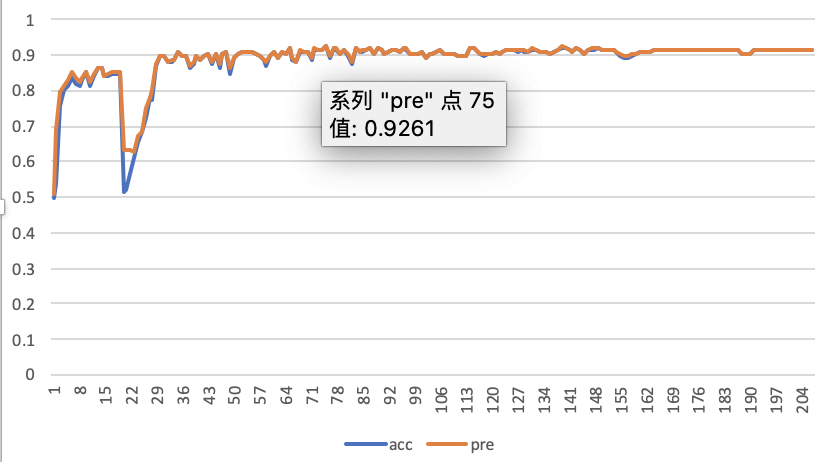acc/pre: 0.924,0.9261 ↑提升1.2个百分点 |
  - tqdm安装：pip install tqdm
    python data_aug.py -h
- 支持环境： py3.7+PaddlePaddle2.0
      -u UNK, --unk UNK                                    #unk 增强策略的概率

      -w W2V_REPLACE, --w2v_replace W2V_REPLACE            #w2v_replace 增强策略的概率
### 效果评测
    
      input                                                #原始待增强数据文件所在文件夹，带label的，一个或多个文本列
      -h, --help            show this help message and exit
      output                                               #输出文件路径
- 一键启动数据增强和训练脚本
      -n AUG_TIMES, --aug_times AUG_TIMES                  #数据集数目放大n倍，output行数为input的n+1倍      
    main
    

```
# 数据增强
| unk      | no                | 随机mask                                    |
      --unk_token UNK_TOKEN                    
    usage: data_aug.py [-h] [-n AUG_TIMES] [-c COLUMN_NUMBER] [-u UNK]
- 使用文心框架中的增强工具在下游任务中进行数据增强，然后再训练

    optional arguments:
